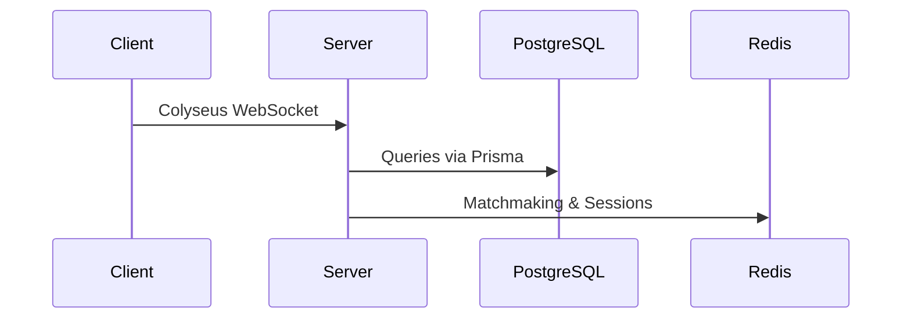

# Architecture

## Monorepo Overview

```mermaid
graph TD
    subgraph Apps
        AC[apps/client]
        AS[apps/server]
    end
    subgraph Packages
        P[@aife/protocol]
        E[@aife/ecs]
        S[@aife/sim]
        N[@aife/netcode]
        U[@aife/ui]
    end
    AC --> P
    AS --> P
    AC --> N
    AS --> N
    N --> S
    S --> E
    AC --> U
```

## Runtime Overview


